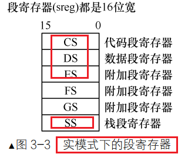

# MakeOS

> [Code Index](https://github.com/yyu/osfs00) | [Linux 发行版](https://www.linuxmi.com/)

### 说明

OrangeS一个操作系统的实现 (于渊) ：WSL Ubuntu-22.04+bochs2.7

操作系统真象还原 (郑纲) ：WSL Ubuntu-20.04+bochs2.6.2


## 0. Tools

### 0.1 GNU/Linux 下的开发环境

用编辑器写代码，Make 调用编译工具生成内核并写入磁盘映像，虚拟机 Bochs 运行所写的 OS。

- 编辑器 vim | emacs；
- 用到 gnu/gcc 中的 C 语言编译器 ；
- 汇编代码编译器 nasm；
- 自动化编译和连接 gnu/make；
- 运行编写的 OS 的虚拟机 bochs；

```bash
sudo apt-get update

# 一组在大多数情况下编译和构建软件所必需的基础工具
# 包含 gcc,Make,gdb,dpkg-dev等
sudo apt-get install build-essential
```

**GCC**

> [GNU Compiler Collection](https://gcc.gnu.org/)

编译器组件，支持多种编程语言，包括 C、C++、Objective-C、Fortran、Ada 和 Go 等。这里主要用到其中的 C 编译器，GCC 要求汇编代码为 AT&T 格式，对于习惯 IBMPC 汇编的读者不友好。


### 0.2 Windows 下开发环境

- 在 Windows 下编写代码；
- 在虚拟机 QEMU 中安装 Linux ，并用 Make 调用 GCC，NASM 等生成内核并写入磁盘映像；
- 在 Windows 下的 Bochs 运行编写的操作系统；


### 0.3 NASM

> [nasm](https://nasm.us/)

在 `WSL` 中借助 `apt` 自动安装

- 对于 Linux 一般安装在 `usr/bin` 目录文件下，其中 `/usr/bin` 前期已经添加到环境变量中；
- 安装到 `/usr/bin/local` 同样性质，不过必要时需手动添加环境变量；

```bash
sudo apt-get update
sudo apt-get install nasm

# 删除软件包，单保留用户数据和配置文件，便于再次安装时恢复以前的设置状态
sudo apt-get remove nasm
# purge 命令在删除包的同时也删除了包的配置文件
sudo apt-get purge nasm
sudo apt-get autoremove             # 删除系统不再使用的孤立软件

# 前置命令，清除过时的软件包，这样可以更精确地释放空间，同时保留当前需要的软件包缓存，以便未来的安装和更新
sudo apt-get autoclean	
sudo apt-get clean                       # 清理所有软件缓存

# 强制删除对应的文件，一般不推荐
sudo rm /usr/bin/nasm
```

#### 伪指令

- `dw`：define word，单字数据 |2 字节（16 位）；
- `dd`：define double word，双字数据 |4 字节（32 位）；
- `dq`：define quad word，4字数据 | 8 字节（64位）；


### 0.4 Bochs

> [Bochs](https://bochs.sourceforge.io/) |  [安装指南](https://www.cnblogs.com/kendoziyu/p/install-bochs-and-qemu-on-ubuntu-20-04.html)

#### 1 源码编译安装(v2.7)

> 对应 WSL 中 Ubuntu-22.04

从源码安装的版本会在其配置和编译过程中根据所在平台的特性去优化，这是其他软件包所不能比拟的。对于 Bochs 默认安装可能缺少调试功能，因此采用从源码安装。

- 安装到 `/usr` 目录中，编译后的文件分布在 `usr/bin` 和 `usr/share` 中；
- 也可以安装到 `/opt/bochs2.6.2` 目录中，方便对第三方软件管理，但需创建链接到 `/usr/bin` 和 `/usr/share` 中；

**安装到 `/usr` 目录中**

- 主要需求是下载文件，特别是需要递归下载或恢复中断的下载，`wget` 可能是更好的选择；
- 需要与Web服务交互，发送各种类型的HTTP请求，或者需要更灵活的网络操作，`curl ` 可能是更好的选择；

```bash
# 编译安装到 /usr中
wget https://sourceforge.net/projects/bochs/files/bochs/2.7/bochs-2.7.tar.gz
tar -zxvf bochs-2.7.tar.gz

# 安装依赖库,先更新
sudo apt-get update
# gcc,gdb,make等一般Linux自带GUN组件
# 否则安装基础组件 build-essential
#sudo apt-get install build-essential

sudo apt-get install -y libx11-dev libc6-dev build-essential xorg-dev libreadline-dev libgtk2.0-dev

cd bochs-2.7

sudo ./configure \
--prefix=/usr/ \
--enable-x86-debugger \
--enable-debugger \
--enable-iodebug \
--with-x \
--with-x11

sudo make
sudo make install
```

#### 2 Bochs 配置文件(2.7)

> **注意查看参考文件的内容 `bochsrc-sample.txt`，所有参数设置都可以发现；**

```bash
# 针对2.7版本创建虚拟软盘
bximage -fd=1.44M -q f1_44M.img
```

**配置文件位置与编辑**

`vim` 编辑时，`:set number` 设文件行号；

```bash
# 参考文件路径
cd /usr/share/doc/bochs
sudo cp  bochsrc-sample.txt ~/

# 配置文件路径
cd	# 返回 home directory
sudo -s
vim .bochsrc

# 仅输入bochs则默认在当前目录寻找以下配置文件
.bochsrc
bochsrc
bochsrc.txt
bochsrc.bxrc # 针对Windows系统

# 或使用自定文件
bochs -f demo.disk
```

**配置文件内容**

```bash
#########################################################
# Configuration file for Bochs
#########################################################
# 1.Bochs 模拟器使用的内存：32MB
megs: 32

# 2.ROM images 名称
romimage: file=/usr/share/bochs/BIOS-bochs-latest
vgaromimage: file=/usr/share/bochs/VGABIOS-lgpl-latest

# 3.设置Bochs所使用的磁盘
# 命名规则，floppya,floppyb...
floppya: image="f1_44M.img", status=inserted

# 4.选择启动盘符
#boot: disk    # 从硬盘启动
boot: floppy # 默认从软盘启动

# 5.设置日志文件输出
log: bochs.out

# 6.开启或关闭某些功能
mouse: enabled=0
keyboard: keymap=/usr/share/bochs/keymaps/x11-pc-us.map
####################Config End###########################
```

#### 3 源码编译安装(v2.6.2)

> 对应 WSL 中 Ubuntu-20.04

**安装到 `/usr` 目录中**

```bash
# 编译安装到 /usr中
wget https://sourceforge.net/projects/bochs/files/bochs/2.6.2/bochs-2.6.2.tar.gz
tar -zxvf bochs-2.6.2.tar.gz

# 安装依赖库
sudo apt-get install -y libx11-dev libc6-dev build-essential xorg-dev libgtk2.0-dev libreadline-dev

cd bochs-2.6.2

sudo ./configure \
--prefix=/usr/ \
--enable-x86-debugger \
--enable-debugger \
--enable-disasm \
--enable-iodebug \
--with-x \
--with-x11
```

**安装到 `/opt` 目录中**

```bash
# 编译安装到/opt中 需要创建链接
sudo ln -s /opt/bochs2.6.2/bin/bochs /usr/bin/bochs
sudo ln -s /opt/bochs2.6.2/bin/bximage /usr/bin/bximage

# 配置文件
cd /opt/bochs2.6.2/share/doc/bochs
sudo -s
vim bochsrc.disk

sudo rm -i /usr/bin/bochs 
```

#### 4  Bochs 配置文件(v2.6.2)

**创建虚拟硬盘**

```bash
# 创建虚拟硬盘2.6.2(注意版本匹配问题)
bximage -hd -mode="flat" -size=60 -q hd60M.img
```

**配置文件位置与编辑- `/usr` 目录下**

```bash
# 参考文件路径
cd /usr/share/doc/bochs
sudo cp  bochsrc-sample.txt ~/

# 配置文件路径
cd	# 返回 home directory
sudo -s
vim .bochsrc

# 仅输入bochs则默认在当前目录寻找以下配置文件
.bochsrc
bochsrc
bochsrc.txt
bochsrc.bxrc # 针对Windows系统

# 或使用自定文件
bochs -f demo.disk
```

**配置文件位置与编辑- `/opt` 目录下**

**`Bochs` 配置文件：参照 `/opt/bochs2.6.2/share/doc/bochs/bochsrc-sample.txt` 设置 `bochsrc.disk`**；

将其放到 `bochs` 的安装目录下：`sudo cp /opt/bochs2.6.2/share/doc/bochs/bochsrc.disk /opt/bochs2.6.2/bin/`；

**配置文件内容**

确保创建好对应的虚拟硬盘：`hd60M.img`，即 `bximage -hd -mode="flat" -size=60 -q hd60M.img  `；

```bash
#########################################################
# Configuration file for Bochs
#########################################################
# 1.Bochs 模拟器使用的内存：32MB
megs: 32

# 2.ROM images 名称
romimage: file=/usr/share/bochs/BIOS-bochs-latest
vgaromimage: file=/usr/share/bochs/VGABIOS-lgpl-latest

# 3.设置Bochs所使用的磁盘
# 命名规则，floppya,floppyb...
# floppya: 1_44 = a.img, status=inserted

# 4.选择启动盘符
# boot: floppy # 默认从软盘启动
boot: disk    # 从硬盘启动

# 5.设置日志文件输出
log: bochs.out

# 6.开启或关闭某些功能
mouse: enabled=0
keyboard: keymap=/usr/share/bochs/keymaps/x11-pc-us.map

# 硬盘设置,hd60M.img为虚拟硬盘名称
ata0: enabled=1, ioaddr1=0x1f0, ioaddr2=0x3f0, irq=14
ata0-master: type=disk, path="hd60M.img", mode=flat, cylinders=121, heads=16, spt=63

# 增加bochs对gdb的支持，通过gdb可远程连接到机器的1234端口调试
# gdbstub: enabled=1, port=1234, text_base=0, data_base=0, bss_base=0

####################Config End###########################
```

#### 5 Bochs Debug

> [The Bochs internal debugger](https://bochs.sourceforge.io/cgi-bin/topper.pl?name=New+Bochs+Documentation&url=https://bochs.sourceforge.io/doc/docbook/user/index.html)

```bash
############针对 bochs2.7############
# List of CPU integer registers and their contents
r|reg|regs|registers         
# List of all CPU registers and their contents,展示CPU寄存器内容,
info cpu

# x后接线性地址
# xp后接物理地址，在实模式中用物理地址
# 默认以4字节为单位来显示
help xp

# 退出
q
```


### 0.5 QEMU

> [A generic and open source machine emulator and virtualizer](https://www.qemu.org/ )

- 在 Linux 下开发，Bochs 一般够用，在 Windows 下开发，需要快一点的虚拟机运行 Linux；
- Bochs 完全模拟硬件及一些外围设备，使用 QEMU 可以模拟较多的硬件平台；
- 不需要调试时，也可以在 Linux 中使用 QEMU；
- 当然 Bochs 的调试功能也是可以自由选择 打开 | 关闭；


### 0.6 Other Commands

```bash
# 0.让更改立即生效
source ~/.bashrc

# 1.创建链接
sudo ln -s /opt/bochs2.6.2/bin/bochs /usr/bin/bochs
sudo ln -s /opt/bochs2.6.2/bin/bximage /usr/bin/bximage
sudo ln -s /opt/bochs2.7/bin /usr/bin/bochs_bin # 文件夹生成链接

# 2.添加系统变量
export PATH=/usr/local/bochs2.7/bin:$PATH # 添加到最前面
export PATH=$PATH:/usr/local/bochs2.7/bin # 添加到最后面

# 3.查找与删除
whereis bochs
sudo rm -rf bochs 

# 4.移动和复制
sudo mv bochs-2.7 /opt/bochs-2.7
sudo cp bochs-2.7 /opt/bochs-2.7
```


### 0.7 errors

> [isuue](https://github.com/microsoft/WSL/issues/6389)

1.在 **WSL2 中 Ubuntu22.0.4** 安装 Bochs 遇到如下问题：

```txt
Message: ROM: couldn't open ROM image file '/usr/share/bochs/BIOS-bochs-latest'
```

解决方法：

```bash
sudo apt-get install -y bochsbios
sudo apt-get install -y vgabios
```

2.问题：

```bash
undefined reference to 'pthread_create'
undefined reference to 'pthread_join'
```

解决方法，用 vim 编译 `Makefile`，添加如下命令：

```bash
sudo vim Makefile

# 95行LIBS行尾添加
-lpthread
```

3.`X windows gui was selected, but X windows libraries were not found.`

解决方法：bochs2.3.5 版本不支持，使用高版本 bochs2.7 解决

```bash
wget https://sourceforge.net/projects/bochs/files/bochs/2.7/bochs-2.7.tar.gz
```


### 0.8 实模式和寻址方式

实模式体现在：程序中用到的地址都是真实的物理地址，即段基址：段内偏移产生的逻辑地址就是物理地址，程序员可以看见完全真实的内存。

8086 是 Intel 第一个 x86 系列的 CPU，即使用 x86 架构。在8086 CPU 中，首次引入段的逻辑形式，以段基址：段内偏移地址的策略访问内存，8086 地址总线 20 位宽，内部寄存器是 16 位，地址总线从 0 开始，即 A0~A19。

**寻址方式**

- 寄存器寻址，操作数在寄存器中；

- 立即数寻址，操作数在指令中给出；

- 内存寻址，内存访问-段基址+偏移地址；

  - 直接寻址，直接给出内存的地址 `mov ax, [0x1234]`，然后再访问内存中的数据

  - 基址寻址，实模式下以 bx, bp 为基址寄存器，ds:bx, ss:bp，保护模式无限制

  - 变址寻址，与基址寻址类似，只是 bx, bp 换成 si, di, 两个寄存器默认的段寄存器位 ds

    `mov [di], ax` 将 ax 中的值存入 ds:di 指向的内存

  - 基址变址寻址，基址寄存器 bx, bp 加上变址寄存器 si, di，`mov [bx+di], ax`


### 0.9 寄存器

不同的 CPU 有不同的寄存器个数，其中 8086CPU 有 14 个寄存器：

**ax, bx, cx, dx, sp, bp, si, di** | **ds, ss, cs, es** | **ip flag(psw)**

#### 通用寄存器

无论是实模式还是保护模式，通用寄存器有 8 个，即**ax, bx, cx, dx, sp, bp, si, di**


通用寄存器具有多种用途，但针对不同名称的通用寄存器具有一些约定的用法；


**段寄存器**

**sreg: ds, ss, cs, es**，16 位 CPU 中，只有一个附加段寄存器 ES，而 FS 和 GS 附加段寄存器是在 32 位 CPU 中增加的。



**标志寄存器：flag**，其中存储的信息称为程序状态字(PSW)。

为了兼容性，16 位寄存器可分为 8 位寄存器，如 AL 和 AH 是**可独立使用的寄存器**；


- 每个寄存器都是 16 位，其中 **ax, bx, cx, dx 为通用寄存器**，存储一般性数据；
- **si, di** 是与 BX 功能相近的寄存器，但是不能够分成 8 位寄存器，**bx 指明一个内存单元 [bx]**，更灵活的寻址方式 **[bx+si+idata] | [bx+di+idata]**；
- 只有 **bx, si, di, bp** 4个寄存器可以用在 [...] 中进行**内存单元寻址**，可以**单个形式出现，或**组合形式出现：**bx+si, bx+di, bp+si, bp+di**，其余组合形式则不存在；
- 只要**在 [...] 使用 bp**，且指令中没有显示给出段地址，则**使用 ss 中的段地址**；

- 存放访问内存的段地址，**cs, ds, ss, es 为段寄存器**，cs-code 代码段地址，ds-data 数据段地址，ss-stack 栈顶段地址；
- **CPU 将 cs:ip 指向的内容当作指令执行(cs×16+ip)**，ip 为指令寄存器，cs 为代码段寄存器；
- ip, cs 没有 mov 指令，需通过转移指令赋值，如 **jmp 3:01b6 类似于 mov cs, 3 | mov ip, 01b6；**
- **ss:sp 指向栈顶元素**，ss 存储段地址，sp 存放偏移地址；

#### section 和 vstart

`section` 是伪指令，不会产生地址和机器指令，地址 = 上一个地址+上一个地址的内容长度。

`section` 对程序中的地址没有任何影响，仅在逻辑上供开发人员梳理程序使用。

`vstart 0x7c00` 和 `org 0x7c00` 的功能相同，即**指定一个虚拟的起始地址**。将之后的指令从该地址开始编译。使用 `vstart` 时一般预先知道程序被加载到某地址处，也**只是告诉编译器后面数据的的起始地址**，数据本身在文件中的地址，即文件偏移量。


### 0.10 显示输出

CPU 和 外设间通过 IO 接口进行协调转换。如声卡是驱动音响设备的 IO 接口，显卡是驱动显示器，可分为集成显卡和独立显卡。IO 接口是连接 CPU 外设的逻辑控制部件，分为软件和硬件两个部分：

- 硬件部分，协调 CPU 和外设之间的不匹配问题，如速度，数据格式，信号电平转换；
- 软件部分，控制接口电路工作的驱动程序以及内部数据传输需要的数据；

为区分 CPU 中的寄存器，io 接口中的寄存器称为端口，`in` 从端口读取数据，`out` 往端口写数据。

#### 显卡

显卡是 PCI 设备，安装在主板 PCI 插槽上，PCI 总线是共享并行架构，要保证数据发送后必须同时到达目的地。

PCI Express, PCIe 总线，串行设备，传输频率快，PCI-Peripheral Component Interconnect, 外设部件互连标准

#### 默认文本模式

默认的模式未：`80*25`，一行 80 个字符，共25 行，即一屏打印 2000 个字符。


### 0.11 硬盘操作方法

#### 硬盘

硬盘扇区在物理的定位：**CHS，Cylinder Head Sector**，扇区-磁头-扇区，对磁头来说直观，但是对人不直观；

**LBA，Logical Block Address**，逻辑上定位扇区地址。从 0 开始编号，不考虑扇区所在的物理结构，其中每个扇区是 512 bit：

- LBA28，28bit 描述一个扇区地址，$2^{28}×2^9(512)=128$GB；
- LBA48，48bit 描述一个扇区地址，$2^{48}×2^9(512)=128$PB；
- LBA 的寄存器，LBA low, LBA mid, LBA high 都是 8bit，总位数 24bit，为了存储 28bit 扇区地址，还需借助 `device` 寄存器的低 4bit；

```assembly
   ; 将寄存器 al 中的内容发送到 dx 寄存器指定的端口(即寄存器)
   	mov dx, 0x1f2       ; 端口地址加载到dx寄存器
    mov al, cl          ; 数据加载到al寄存器
    out dx, al          ; al寄存器的数据发送到指定的端口处
    mov eax, esi        ; 恢复
```


#### 硬盘控制器

硬盘控制器属于 IO 接口，此处的端口指的是硬盘控制器上的寄存器。

主板提供两个 IDE 插槽—IDE0 和 IDE1，其中 IDE0 为 Primary 通道，IDE1 为 Secondary 通道。

- 兼容以前的 PATA, Parallel ATA 并行接口，PATA 接口线缆也称为 IDE 线，一个 IDE 线上挂两块硬盘，一个是 主盘 Master，另一个是从盘 Slave。两个 IDE 支持 4 块硬盘；
- 主流为 SATA, Serial ATA 串行接口，插槽为 L 形；

**端口**
**注意寄存器的位数从 0 开始数**

- `sector count` ：8bit reg，为 0，表示要操作 256 个扇区，指定待读取或待写入的扇区数，硬盘每完成一个扇区，就将此寄存器的值减1；

- `device`：8bit reg，低 4bit 存储 LBA 地址的 24~27 位，第 4bit 指定 master 还是 slave，第 6bit 设置是否启用 LBA 方式；
- `status`：8bit reg，**读硬盘时的名称**，表示硬盘状态信息，是否出错 | 数据是否准备好 | 硬盘是否正在忙。`command`：和 `status` 为同一个，**写硬盘时的名称**，存储让硬盘执行的命令；


**硬盘操作步骤**

1. 选择通道，向通道的 `sector count` 寄存器写入待操作的扇区数；
2. 向该通道的 3 个 LBA 寄存器写入扇区起始地址的低 24 位；
3. 向 `device` 寄存器写入 LBA 地址的 24~27 位，并置第 6 位为 1，使其为 LBA 模式；
4. 向 `command` 寄存器写入操作的命令；
5. 读取 `status` 寄存器，判断硬盘工作是否完成；

**操作扇区数 > 写入待寻找的 LBA 地址 > 写入操作命令 > 执行操作**


## 1. 创建 MBR

### 1.1 概述

#### 术语

-  BIOS（基本输入输出系统）；
-  **MBR**（主引导记录，Master 或 Main Boot Record），整个**硬盘最开始扇区以 0x55 和 0xaa 结束**，MBR 所在的扇区称为 MBR 引导扇区，有且只有一个；
-  EBR（拓展引导记录），与 MBR 结构相同，数量取决于拓展分区；
-  CHS 方式扇区编址起始为1，LBA 扇区编址起始位 0；
-  **OBR**（操作系统引导扇区，OS Boot Record），也称内核加载器，数量与主分区数和扩展分区数有关。位于**各分区最开始的扇区，以 0x55 和 0xaa 结束**；
-  DBR（DOS 操作系统引导记录，DOS Boot Record），后来演变为 OBR；

#### 内存布局

- 内存条需要占用地址总线的地址空间，外设同样需要占用地址总线，因此需要将一些地址总线的地址空间预留出来；
- 即使内存条和地址总线大小一样，因为外设也占用地址空间的缘故，因此内存条利用不完全；

#### BIOS 

BISO 在实模式下运行，而实模式只能访问 1MB 空间。

cpu 采用分段方式访问内存，即段地址+偏移地址。

#### 过程

1. 接电后，运行，开机的时候，CPU 的 cs:ip 初始化为 **0xF000:0xFFF0**，此时处于实模式，cs 左移 4 位，等效地址为 **0xFFFF0**，此地址中存储一个跳转指令，用于跳转到 BISO 真正的起始地址位置，然后运行 BISO 开机自检，初始化硬件；
2. BIOS 程序的最后一步是检查软盘的 0 面 0 磁道 1 扇区，最后跳转到 0x7c00 地址处。**MBR 在固定位置**，整个磁盘最开始的扇区等待，即 0 盘 0 道 1 扇区；
3. 安装了操作系统的**活动分区**在 MBR 分区变项中**标记为 0x80**，MBR 跳转到活动分区的操作系统内核加载器，**内核加载器在**活动分区的**固定位置**；


### 1.2 MBR

> 0x7c00 中的 MBR

#### 1 原理

BIOS 检查软盘的 0 面 0 磁道 1 扇区，发现以 0xaa，0x55 结尾则表示其为引导扇区 MBR，该扇区包含 512B 的执行程序。之后 BIOS 将这 512B 装载到内存 **0x7c00**，然后跳转到该位置。

注：从 sector[0] 开始，8B，sector[510]\==0x55，sector[511]==0xaa，bochs 采用小端存储，即高位高字节，低位低字节

#### 2 编译写入软盘

引导扇区代码 `mbr.asm`

**$** 给编译器给当前行安排地址，**$\$** 编译器给的 section 起始地址。section 由编译器 nasm 给开发人员逻辑上规划代码用，最终对应的纹理地址解释权由 nasm 决定。

```asm
# OrangeOS bochs2.7
	org	07c00h			; where the code will be running
	mov	ax, cs
	mov	ds, ax
	mov	es, ax
	call	DispStr			; let's display a string
	jmp	$			; 跳转到自身，导致无限循环
DispStr:
	mov	ax, BootMessage
	mov	bp, ax			; ES:BP = string address
	mov	cx, 16			; CX = string length
	mov	ax, 01301h		; AH = 13,  AL = 01h
	mov	bx, 000ch		; RED/BLACK
	mov	dl, 0
	int	10h
	ret
BootMessage:		db	"Hello, OS world!"
times 	510-($-$$)	db	0	; fill zeros to make it exactly 512 bytes
dw 	0xaa55				; boot record signature
```

编译引导扇区代码，写入前面创建号的软盘中 `f1_44M.img`

```bash
# 编译，得到512B
nasm boot.asm -o boot.bin
# notrunc确保软盘文件不被截断
dd if=boot.bin of=../f1_44M.img bs=512 count=1 conv=notrunc
```

#### 3 调试过程

> [The Bochs internal debugger unit8](https://bochs.sourceforge.io/cgi-bin/topper.pl?name=New+Bochs+Documentation&url=https://bochs.sourceforge.io/doc/docbook/user/index.html)

```bash
# 直接执行，不间断
bochs
c

# 设置断点
b 0x7c00
# 继续执行，直到断点处
c
# 查看cpu
info cpu
# 查看内存,64B，x-16进制，b-单个字节查看
x /64xb 0x7c00
# 两个字节查看 h, 共128B
x /64xh 0x7c00
# 指令让代码走向下一步
n

# 查看命令帮助
h trace-reg
# 追踪reg,让bochs每一步都显示主寄存器的值
trace-reg on
```


## 2. 保护模式

```shell
 nasm pmtest1.asm -o pmtest1.bin
 dd if=pmtest1.bin of=a.img bs=512 count=1 conv=notrunc
```

引导扇区的空间只有 512 字节，当程序过大时，通过 dd 将 `.bin` 文件的方法就会失效，因此选择 DOS 将程序编译成 COM 文件，然后让 DOS 执行它。

### 2.1 概述

在保护模式下，物理地址不能被直接访问，虚拟地址需要被转化为物理地址后才能再去访问。而地址转换由处理器和操作系统共同协作完成的：

- 处理器在硬件上提供地址转换部件；
- 操作系统提供转换工程所需的页表；

#### 实模式 VS 保护模式

32 位 CPU 具有两种运行模式，其中 16 位的运行模式为实模式，32 位的运行模式为保护模式。**实模式是在 32 位 CPU 时才提出的，与存粹的 16 位 CPU，如8086无关**。32 位 CPU 在 16 位的实模式下运行，仍然具备 32 位操作数的处理能力。

保护模式对内存段的描述更加安全，其中内存段的信息专门用**全局描述符表**进行存储：

- 表中的每个表项称为段描述符，大小64B，**描述内存段的起始地址，大小，权限等信息**；
- 全局描述符表很大，存放在内存中，访问效率不高，由 GDRT 寄存器指向；
- 段寄存器保存的位选择子(selector)，用来**索引全局描述符表中的段描述符**，selector 类似于下标；
- 段描述符的数据分散在不同位置，需要 CPU 将数据进行整合，形成完整数据；

由于 CPU 访问内存的内容效率过低，因此将前期 CPU 整合好的段描述符缓存在寄存器中，即**段描述符缓冲寄存器(Descriptor Cache Registers)**，以后访问相同段时，直接读取寄存器中的内容即可。

**寻址方式**

实模式下的 reg 有固定的用途，保护模式的寻址方式灵活，基址寄存器是所有 32 位的通用寄存器，变址寄存器是除 esp 外的 32 位寄存器。

**CPU 变动**

对于 IA32（Intel Architecture 32-bit）体系架构的 CPU，其内存访问方式还是分段策略。

**80286**：鸡肋产品，首款具有保护模式的 CPU 但 16 位，寄存器 16 位，地址总线 20 位，可访问空间 16MB；

**80386**：1985 年推出，地址总线 32 位，寄存器 32 位，开始平坦模式时代；

**寄存器拓展**

16 位 8086 CPU 中的基址偏移是不得已而为之，而新的 32 位 CPU 则需要对 reg 进行拓展，使其能够访问 4GB 内存空间。

- 除了**段寄存器（仍保留 16 位）**外，其余寄存器均从 16 位拓展到 32 位；
- 拓展(extend)后的寄存器，统一在名字前加 e；


**指令拓展**

`mul` 无符号数相乘指令（有符号乘法指令 `imul`）：

- 乘数为 8 位，`al` 为另一乘数，结果 16 位，存入 `ax`；
- 乘数为 16 位，`ax` 为另一乘数，结果 32 位，存入 `eax`；
- 乘数为 32 位，`eax` 为另一乘数，结果 64 位，高 32 位存入 `edx`，低 32 位存入 `eax`；

`div` 无符号除法指令：

- 除数为 8 位，被除数 16 位(`ax`)，商在 `al`，余数 `ah`；
- 除数为 16 位，被除数 32 位(高 16 位在 `dx`，其余在 `ax`)，商在 `ax`，余数 `dx`；
- 除数为 32 位，被除数 64 位(高 32 位在 `edx`，其余在 `eax`)，商在 `eax`，余数 `edx`；

#### 指定编译模式

兼容性使得 CPU 同时支持 16 位和 32 位的指令，但对于需要指定编译器编译的机器码位数，这就需要借助编译器的伪指令 `bits` 解决，`bits` 指令的范围是当前 `bits` 到下一个 `bits`，默认为 `[bits 16]`。

- `[bits 16]`：编译为 16 位的机器码；
- `[bits 32]`：编译为 32 位的机器码；
- 使用 `bits` 指令，需要清楚代码在那种模式下运行，从而向编译器指定编译对应位数的机器码；
- 对在 `bits` 作用范围内模式不匹配的指令，**编译器自动在操作数机器码**前添加 `0x66` 模式反转前缀，寻址方式反转前缀 `0x67`；
- 编译器通过在机器码前添加反转前缀，临时将当前运行模式下的操作数和寻址方式转换为另一种模式下的操作数和寻址方式；


### 2.2 描述符

#### GD全局描述符

> Global Descriptor，GD

保护模式下的内存段登记表，仍然是 IA32 结构处理器的段基址：段内偏移地址。其后描述的描述符大小都为**连续的 8字节**，即 64 位。


- 保护模式下地址总线宽度 32 位，段基址也是 32 位；
- 段界限表示段边界的拓展最值，数据段向上拓展，地址越来越高；栈段向下拓展，地址越来越低。段界限是一个偏移量，表示段的边界、大小、范围等；
- 段界限共 20 位，单位是 `B`(G=0，粒度为 1B) 或 `KB`(G=1，粒度为 4KB)，表示偏移了多少 `B` 或多少 `KB`；
- 由于历史问题，考虑到兼容性，段界限和段基址是分开存放的；
- `S` 字段为 0，表示系统段，为 1 表示数据段（硬件需要的数据为—系统段，软件需要的数据—数据段）；
- `type` 字段指定描述符的类型。4 位，该段是否访问过-A，一致性代码段-C，一般限制代码段是否可读-R，是否可执行-X，是否可写-W，拓展方向-E；
- `DPL`，Descriptor Privilege Level，描述符特权等级。2 位，保护模式提供的内存安全访问解决方案，共 0，1，2，3 级特权，数字越小，特权等级越大；
- `P`，Present，该段是否存在于内存中；
- `AVL`，availale，操作系统可随意用此位；
- `L`，保留位，是否设置为 64 位代码段；
- `D/B` (代码段或栈段) 字段，指示段内偏移地址及操作数的大小；
- `G` 段，Granularity，粒度，指定段界限的单位大小；

#### GDT全局描述符表

> Global Descriptor Table，GDT

一个段描述符定义一个内存段，段描述符放在全局描述符表，并通过选择子提供的下标在 GDT 中索引 GD。

**专用寄存器 GDT Register(48 位) 用来存储 GDT 的地址**，`lgdt` 指令访问 GDTR：

- 寄存器 GDTR 的**前 16 位为 GDT 的界限值**，单位 B；
- **后 32 位是 GDT 的起始地址**，每个 GD(全局描述符) 大小为 8 字节；

实模式下，段寄存器存放的是段基址，而保护模式中，段描述符已经存储了段基址，此时段寄存器存放 selector 选择子，类似于索引值，可在段描述符表中索引段描述符。

#### Selector 选择子

段寄存器 16 位，存储选择子。

- 0-1 位，存储 `RPL`，Request Privilege Level，共 0，1，2，3 四种特权等级；
- 2 位，`Ti`，Table Indictor，选择子是在 GDT(全局) 还是 LDT(局部) 索引段描述符；
- 3-15 位，共 13 位，段描述符的索引值；
- 选择子未初始化时为 0，则指向 GDT 的第 0 各段描述符，为避免出现这种情况 GDT 的第 0 段描述符不可用；


**A20 地址总线**

实模式下，对于超过 1MB 的部分采用地址回绕(warp-around)，而打开 A20，第 21 条地址总线可避免 warp-around。

```assembly
# 打开 A20Gate,将端口 0x92 的第 1 位设置为 1
in al, 0x92
or al, 0b00000010
out 0x92, al
```

**CR0**

设置 CR0 寄存器的第 0 位，即 PE(Protection Enable) 位，控制保护模式的开启 | 关闭。

```assembly
mov eax, cr0
or eax, 0x00000001
mov cr0, eax
```


### 2.3 保护模式

- `mbr.s` 更改，由于 `loader.bin` 文件超过一个扇区大小-512B，因此 `mbr.s` 中扩大加载的扇区数量；
- 在 `loader.s` 中进入保护模式，`loader.bin` 文件超过 512B；


