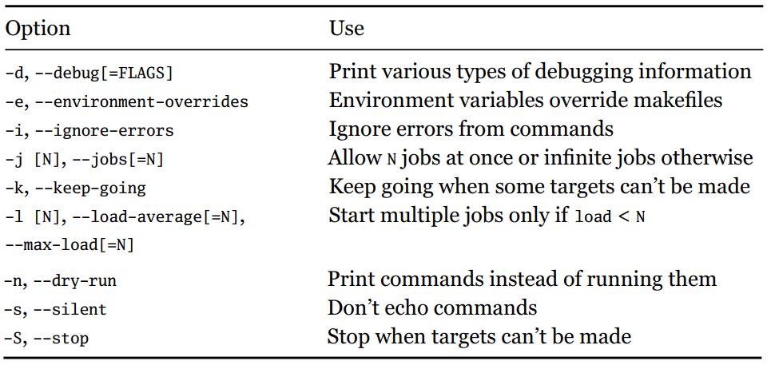

# Makefile_intro

> [跟我一起写 Makefile-陈皓](https://blog.csdn.net/haoel/article/details/2886) | [make 开发者 Richard Stallman](https://www.stallman.org/)

[跟我一起写 Makefile（一）](https://blog.csdn.net/haoel/article/details/2886)

[跟我一起写 Makefile（二）](https://haoel.blog.csdn.net/article/details/2887?spm=1001.2014.3001.5502)

[跟我一起写 Makefile（三）](https://haoel.blog.csdn.net/article/details/2888?spm=1001.2014.3001.5502)

[跟我一起写 Makefile（四）](https://haoel.blog.csdn.net/article/details/2889)

[跟我一起写 Makefile（五）](https://haoel.blog.csdn.net/article/details/2890?spm=1001.2014.3001.5502)

[跟我一起写 Makefile（六）](https://haoel.blog.csdn.net/article/details/2891?spm=1001.2014.3001.5502)

[跟我一起写 Makefile（七）](https://haoel.blog.csdn.net/article/details/2892?spm=1001.2014.3001.5502)

[跟我一起写 Makefile（八）](https://haoel.blog.csdn.net/article/details/2893?spm=1001.2014.3001.5502)

[跟我一起写 Makefile（九）](https://haoel.blog.csdn.net/article/details/2894?spm=1001.2014.3001.5502)

[跟我一起写 Makefile（十）](https://haoel.blog.csdn.net/article/details/2895?spm=1001.2014.3001.5502)

[跟我一起写 Makefile（十一）](https://haoel.blog.csdn.net/article/details/2896?spm=1001.2014.3001.5502)

[跟我一起写 Makefile（十二）](https://haoel.blog.csdn.net/article/details/2897?spm=1001.2014.3001.5502)

[跟我一起写 Makefile（十三）](https://haoel.blog.csdn.net/article/details/2898?spm=1001.2014.3001.5502)

[跟我一起写 Makefile（十四）](https://haoel.blog.csdn.net/article/details/2899?spm=1001.2014.3001.5502)


## 1. 概述

makefile 关系到整个工程的编译规则，一个工程的源文件按类型，功能，模块放到目录中。makefile 则定义系列规则来指定那些文件需要先编译，那些需要后编译等。

makefile 的好处就是自动化编译，借助 make 命令整个工程即可自动编译，**make 是一个命令工具，用于解释 makefile 中的指令**。大多数 IDE 具备该命令，如 `Delphi` 的 `make`，`Visual C++` 的 `nmake` 以及 `Linux` 下 `GNU` 的 `make` 等。

### 1.1 环境

make 3.80，遵循 IEEE 1003.2-1992 标准的（POSIX.2）

OS：RedHat Linux 8.0

编译器：UNIX 下的 GCC 和 CC


### 1.2 编译与链接

对于 C、C++

- 编译(compile)：源文件先编译成中间代码文件(Object file)，Windows 下的 `.obj` 文件，UNIX 下的 `.o` 文件；

- 链接(link)：将大量的中间代码文件合并执行；

**编译时**：要求**语法**正确，**函数与变量声明**正确(告诉编译器头文件所在的位置)；

**链接时**：链接函数和**全局变量**。大多是情况，由于中间目标文件太多，而链接时需要明显地指出中间文件名，为了方便起见，将中间目标文件打个包，Windows 下的这种包为库文件 `Library File`，即 `.lib` 文件，UNIX 下为 `Archive File`，即 `.a` 文件。


### 1.3 Makefile

make 命令执行需要一个 Makefile 文件，说明如何去编译和链接程序。

```makefile
target demo.o: prerequisites
command
```

- `target` 为目标文件，可以为 Object file，执行文件，标签(Label)；
- `prerequistites` 生成 `target` 所需的文件或目标；

`make clean` ：删除执行文件和所有的中间目标文件；

```shell
# make [option] [target]
make target
```

如果 `make` 后没有跟 target，则会按照默认的 target 文件去运行，一般是 `makefile` 文件的首个 `target`



如 `make j2` 一次允许 2 个作业，特别适合多核 CPU 的情况。


## 2. Makefile 命令简化

输入 `make` 命令后，会在目录下找名称为 `Makefile` 或 `makefile` 的文件。找对应的依赖关系，如果冒号后面的文件不存在则退出工作。

### 2.1 逐步简化

**使用变量**

```makefile
objects = main.o kbd.o command.o display.o /
              insert.o search.o files.o utils.o

    edit : $(objects)
            cc -o edit $(objects)

    main.o : defs.h
    kbd.o : defs.h command.h
    command.o : defs.h command.h
    display.o : defs.h buffer.h
    insert.o : defs.h buffer.h
    search.o : defs.h buffer.h
    files.o : defs.h buffer.h command.h
    utils.o : defs.h

    .PHONY : clean
    clean :
            rm edit $(objects)
```

**make 的隐晦规则**

对于 `.o` 文件，其完整形式为，由于 GNU 的 make 很强大，可以自动推导文件及文件依赖关系后面的命令。如看到 `demo.o` 文件，自动将对应的 `demo.c` 文件加入到依赖关系中，并进一步将 `cc -c demo.c` 命令也推导出来。

```makefile
main.o : main.c defs.h
      cc -c main.c
# make的隐晦规则
    main.o : defs.h
```

**进一步规整 `.h` 文件**

虽然文件变得更简单，但是依赖关系不太清晰，不太推荐。

```makefile
objects = main.o kbd.o command.o display.o /
       insert.o search.o files.o utils.o

  edit : $(objects)
      cc -o edit $(objects)

  $(objects) : defs.h
  kbd.o command.o files.o : command.h
  display.o insert.o search.o files.o : buffer.h

  .PHONY : clean
  clean :
      rm edit $(objects)
```


### 2.2 清空目标文件

每个 `Makefile` 文件中都应该有这样一个清空目标文件和执行文件的规则，便于重新编译和保持文件清洁。一个不成文的规定是，一般将 `clean` 规则放在文件的最后。

```makefile
clean:
	rm edit $(objects)
	
# 更稳健的做法是
.PHONY: clean
clean:
	-rm edit $(objects)
```

其中 `.PHONY` 表示 `clean` 是一个伪目标，`rm` 前面的 `-` 表示**出现问题后不中断**继续进行后面的事情。


## 3. Makefile 总述

**Makefile 中的命令以 Tab 键开始**

### 3.1 Makefile 组成与文件名

**Makefile 主要包含**

- 显示规则：如何生成一个或多个目标文件，显式指出要生成的文件，文件的依赖文件，生成的命令；
- 隐晦规则：根据 `make` 的自动推导功能，简写 Makefile；
- 变量定义：在 Makefile 中定义的变量一般都是字符串，Makefile 执行时，其中的变量会拓展到相应的位置上；
- 文件指示：1.在一个 Makefile 中引用另一个 Makefile；2.根据情况指定 Makefile 中有效的部分；3.定义一个多行命令；
- 注释：只有行注释，使用 `#` 字符

**Makefile 文件名**

运行 `make` 命令后，会自动**在当前目录下按顺序寻找名为 `GNUmakefile`，`makefile`，`Makefile` 的文件，最好使用 `Makefile` 文件名**。

如果要指定**特定的 Makefile** ，则**使用** `make` 的 **`-f` 和 `--file`** 参数。

```makefile
make -f Make.Linux
make --file Make.AIX
```


### 3.2 引用其他 Makefile

**使用 `include` 关键字将 Makefile 包含进来**，`include` 前面可以有一些空字符，但不能是 `Tab` 键开始。

```makefile
# Makefile: a.mk, b.mk, c.mk,文件 foo.make, 变量$(bar) 包含 e.mk,f.mk
bar =  e.mk,f.mk
include foo.make *.mk $(bar)

# 等价于
include foo.make a.mk b.mk c.mk e.mk f.mk

# -表示继续执行不退出，无论 include出现什么错误，都不报错及，继续执行
-include <filename> 
```

- 如果文件没有指定绝对路径或相对路径的话，`make` 先在当前目录下寻找；
- `make` 执行时，有 `-I` 或 `--include-dir` 参数，则在指定目录下寻找；
- `/usr/local/bin` 或 `/usr/include` 存在的话，也会寻找；

建议不使用环境变量 `MAKEFILES` ，容易影响其他的 `MAKEFILE`；


### 3.3 MAKE 的工作方式

GNU 的 make 工作时，执行如下步骤(1-5为第一阶段，6-7为第二阶段)：

1. 读入所有的 Makefile；
2. 读入被 include 的其他 Makefile；
3. 初始化文件中的变量；
4. 推导隐晦规则并分析所有规则；
5. 为所有的目标文件创建依赖关系链；
6. 根据依赖关系，决定那些目标要重新生成；
7. 执行生成命令；


## 4. 书写方式

### 4.1 书写规则

规则包含两个部分：

- **文件的依赖关系；**
- **如何生成目标的方法；**

```makefile
# foo.o 目标
# foo.c和defs.h为依赖的源文件
# 以Tab键开头的 cc命令
foo.o : foo.c defs.h       # foo模块
	cc -c -g foo.c
```

- 目标文件 `foo.o` 依赖于 `foo.c` 和 `defs.h`；
- 通过命令 `cc -c -g foo.c` 生成 `foo.o` 文件；

**规则语法**

```makefile
targets : prerequisites
	command
	...

# 另一种方式
targets : prerequisites; command
	command
	...
```

- `targets` 是文件名，可使用通配符；
- `command` 是命令行，以 Tab 键开头；
- `prerequisites` 是目标依赖的文件，如果**依赖的文件比目标文件新**，则目标需要重新生成；
- 命令太长，使用 `/` 作为换行符，`make` 一行上的字符数没有限制

**在规则中使用通配符**

- `make` 支持三种通配符，即 `*`, `?`, `[...]`；
- 真正的字符设置可以使用转义字符 `/`；

- `~` 指向当前用户 `$HOME` 目录下的内容；

```makefile
# $? 为自动化变量
print: *.c
	lpr -p $?
	touch print
	
# 变量赋予所有 .o 文件名的集合,由关键字 wildcard指出
objects := $(wildcard *.o)
```


### 4.2 文件搜寻

在拥有大量源文件的工程中，通常做法是将许多源文件分类，存放在不同的目录中。然后将路径告知 `make`。

`Makefile` 文件中的特殊变量 `VPATH` 就是完成这个功能，未设定 `VPATH` 时，make 只在当前目录中寻找，定义之后，还会再 `VPATH` 中寻找。

```makefile
# 首先在当期目录寻找，然后在 VPATH 中寻找
# 当前定义 src和../headers 两个目录，路径由 : 分隔
VPATH = src:../headers
```

另一种方法是使用 `make` 的 `vpath` 关键字(小写表示关键字，不是变量)，该方法更为灵活：

```makefile
# 1.符合模式 <pattern> 则搜素目录 <directories>
vpath <pattern> <directories>

# 2.清除符合模式<pattern>文件的搜索目录
vpath <pattern>

# 3.清除已被设置好的文件搜索目录
vpath

```

- `<pattern>` 需要包含 `%` 字符，`%` 为匹配 0 或若干个字符

```makefile
# 要求make在../headers目录下搜索所有以.h结尾的文件
vpath %.h ../headers

# 连续使用vpath指定不同的搜索策略，按先后顺序执行搜索
# 连续的vapth中出现相同的 <pattern>
# 以.c结尾的文件，先在 foo 目录，然后是blish目录，最后是 bar目录
vpath %.c  foo
vpath %   blish
vpath %.c  bar

# foo->bar->blish
# 先foo目录，然后是bar目录，最后是blish目录
vpath %.c  foo:bar
vpath %    blish
```


### 4.3 伪目标

通过 make 生成许多编译文件后，为了提供一种清除它们的一种手段，使用伪目标；

伪目标只是一个标签，不是文件，需要显示指明这个目标才能生效；

```makefile
# 使用 .PHONY 显示指明一个目标为伪目标
.PHONY: clean
clean:
	rm *.o temp
```

**目标文件可以称为伪目标的依赖**

```makefile
# all 伪目标依赖其他三个文件目标
# 伪目标总时被执行，因此总是比依赖的三个文件目标新
all: prog1 prog2 prog3
.PHONY: all
prog1: prog1.o utils.o
	   cc -o prog1 prog1.o utils.o
prog2: prog2.o
	   cc -o prog2 prog2.o
prog3: prog3.o sort.o utils.o
	   cc -o prog3 prog3.o sort.o utils.o
```

**伪目标也可以成为依赖**

```makefile
# 伪目标成为依赖，类似于子程序
.PHONY: cleanall cleanobj cleandiff
cleanall: cleanobj cleandiff
		rm program
cleanobj: 
		rm *.o
cleandiff:
		rm *.diff
```

- `make clean` 清除所有文件；
- `make cleanobj` 和 `make cleandiff` 清除不同种类的文件；


### 4.4 多目标

可能出现多个目标依赖于同一个文件，可以使用**自动化变量 `$@` 表示目前规则中所有目标的集合**。

```makefile
bigoutput littleoutput: text.g
	generate text.g -$(subst output,, $@) > $@

# 等价于
bigoutput: text.g
	generate text.g -big > bigoutput
littleoutput: text.g
	generate text.g -little > littleoutput
```

- `$(subst output,, $@)` 中的 `$` 表示执行一个 `Makefile` 函数 `subst`，即截取字符串，后面为参数；

- `$@` 表示目标的集合，类似一个数组；


### 4.5 静态模式

```makefile
targets: target-pattern: prereq-patterns
	commands
```

- targets 目标文件，可以有通配符，是目标的一个集合；
- target-pattern 指明 targets 模式；
- prereq-patterns 为目标的依赖模式，进行依赖目标定义；

```makefile
# example
objects = foo.o bar.o
all: $(objects)
$(objects): %.o: %.c
	$(CC) -c $(CFLAGS) $< -o $@
	
# 等价形式
foo.o : foo.c
	$(CC) -c $(CFLAGS) foo.c -o foo.o
bar.o : bar.c
	$(CC) -c $(CFLAGS) bar.c -o bar.o
```

- `%.o` 表示前面的目标集合，`foo.o` 和 `bar.o`，其中 `%` 就代表 `foo` 和 `bar`；
- 依赖目标为 `foo.c` 和 `bar.c`；
- `$< ` 为自动化变量，表示依赖的目标集，即 `foo.c` 和 `bar.c`；
- `$@` 自动化化变量，表示目标集，即 `foo.o` 和 `bar.o`；


### 4.6 自动生成依赖性

在 Makefile 中，依赖关系需要包含一些列头文件，如在  `main.c` 文件中的 `#include "defs.h"` ，则依赖关系为  

`main.o : main.c defs.h`；

大多数 `C/C++` 编译器支持 `-M` 选项，即自动寻找源文件中包含的头文件，并生成依赖关系

```makefile
cc -M main.c

# 自动引入依赖，输出为
main.o : main.c defs.h

# gcc 自动依赖引入参数设定
gcc -MM main.c
```

GNU 组织建议将编译器为每个源文件生成的**依赖关系放到一个文件中**，如为每个 `name.c` 文件都生成一个 `name.d` 的 Makefile 文件，`.d` 文件中存放对应 `.c` 文件的依赖关系。

产生 `.d` 文件的模式规则，在编译器中加入 `.d` 文件的依赖，即：

```makefile
main.o : main.c defs.h

# 变为
main.o main.d : main.c defs.h

# 将自动生成的规则加入
# $(sources:.c=.d)表示将变量 $(sources)所有的.c字符串替换为.d
sources = foo.c bar.c
include $(sources:.c=.d)
```

需要注意的是 `include` 是按次序载入文件的，最先载入的 `.d` 文件的目标为默认目标。


